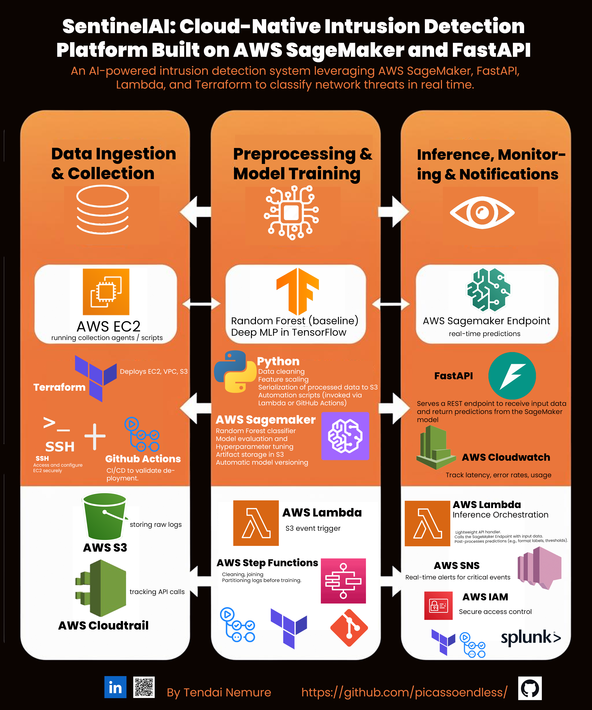

# SentinelAI: Cloud-Native Intrusion Detection Platform on AWS SageMaker and FastAPI

An AI-powered intrusion detection system leveraging AWS SageMaker, FastAPI, Lambda, and Terraform to classify network threats in real time.

---

## 📌 Overview

**SentinelAI** is an end-to-end cloud-native pipeline for detecting intrusions and anomalies in network logs. The system is fully automated, serverless where possible, and leverages modern ML tooling to classify threats with high accuracy.

---
## 📈 Architecture Overview

<p align="center">
  
</p>

## 🛠️ Key Features

- **Data Ingestion & Collection**
  - EC2 instances running collection agents and scripts
  - S3 storage of raw logs
  - CloudTrail tracking of API calls
  - Terraform infrastructure provisioning (EC2, VPC, S3)
  - SSH for secure configuration
  - GitHub Actions for CI/CD deployment validation

- **Preprocessing & Model Training**
  - Python scripts for data cleaning, scaling, and serialization
  - Random Forest classifier as baseline
  - Deep MLP models in TensorFlow
  - SageMaker for training, evaluation, and artifact storage
  - Step Functions to orchestrate preprocessing workflows
  - Lambda triggers based on S3 events

- **Inference, Monitoring & Notifications**
  - SageMaker Endpoint hosting trained models
  - FastAPI REST interface for real-time predictions
  - CloudWatch metrics and logs
  - Lambda functions for inference orchestration
  - SNS notifications on critical events
  - IAM policies for secure access control

---

## 📈 Architecture Overview


---

## 💡 Technologies Used

- **AWS EC2**
- **AWS VPC**
- **AWS S3**
- **AWS SageMaker**
- **AWS Lambda**
- **AWS CloudTrail**
- **AWS CloudWatch**
- **AWS SNS**
- **AWS Step Functions**
- **AWS IAM**
- **Terraform**
- **GitHub Actions**
- **Python**
- **TensorFlow / Keras**
- **FastAPI**
- **NSL-KDD Dataset**
- **SSH**

---

## ⚙️ How It Works

1. **Ingestion**
   - Raw logs are collected via EC2 collection agents.
   - Logs are stored in S3 and tracked with CloudTrail.
   - Terraform provisions all core infrastructure.

2. **Preprocessing & Training**
   - Lambda triggers preprocessing when new data arrives.
   - Python scripts clean, encode, and scale the data.
   - SageMaker trains Random Forest and deep learning models.
   - Model artifacts are saved in S3.

3. **Inference & Monitoring**
   - SageMaker Endpoint hosts the production model.
   - FastAPI serves a REST API for real-time scoring.
   - CloudWatch tracks usage, latency, and errors.
   - SNS alerts notify stakeholders of critical events.

---

## 🚀 Getting Started

### Prerequisites

- AWS account with sufficient permissions
- Terraform installed
- Python 3.8+
- AWS CLI configured
- Docker (for SageMaker custom containers)

---

### Deployment Steps

1. **Provision Infrastructure**
   ```bash
   terraform init
   terraform apply
